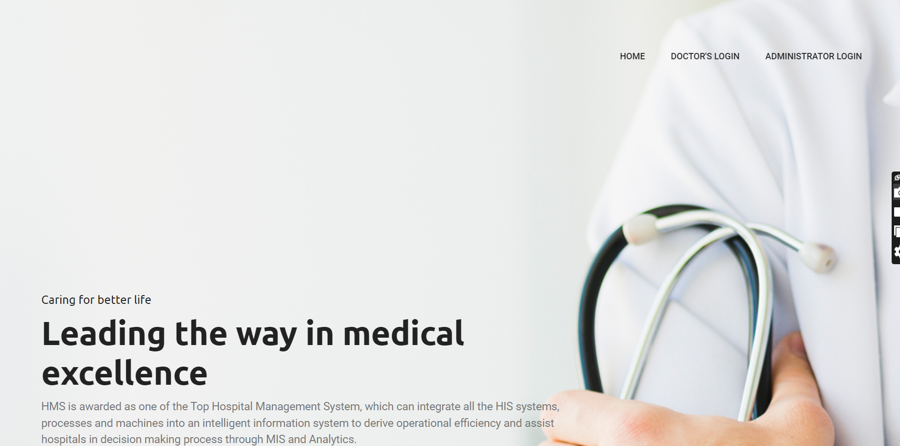
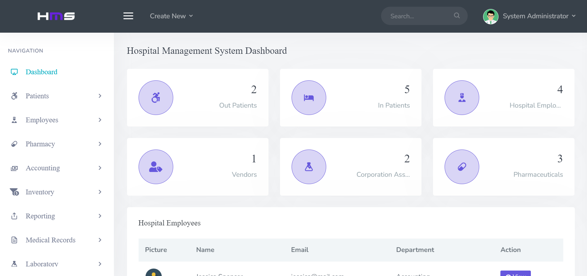
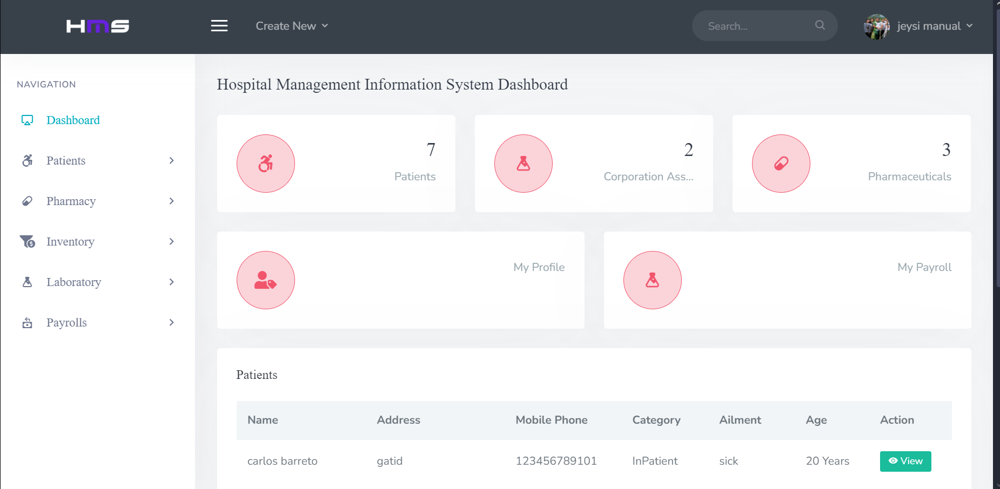

# SD-3101 [Hospital Management System]



## Table of Contents
- [Introduction](#introduction)
- [Project Overview](#project-overview)
- [Objectives](#objectives)
- [Features](#features)
- [Technologies Used](#technologies-used)
- [Setup and Installation](#setup-and-installation)
- [Usage Instructions](#usage-instructions)
- [Project Structure](#project-structure)
- [Contributors](#contributors)
- [Chagelog](#changelog)
- [Acknowledgments](#acknowledgments)
- [License](#license)

---

## Introduction
This Hospital Management System focuses on managing medical records, reports, and inventory within a hospital setting. The system enables easy management of patient data, medication stocks, and detailed reports for doctors and administrators, improving overall efficiency.

## Project Overview
This Facility Management System is designed to streamline hospital operations, focusing on medical record management, including pharmacy and laboratory data. The system caters to both administrative staff and medical professionals (doctors and employees). It allows users to manage patients, staff, medications, and inventories efficiently, with real-time access to medical reports.

## Objectives
State the main objectives of the capstone project, such as:
- Develop a comprehensive system to manage hospital resources, including patient records and medical supplies.
- Provide secure access for doctors and administrators.
- Enable easy tracking of medical reports and stock levels for medicines.

## Features
List the main features of the project:
- Admin Panel: Allows management of personnel, medications, and overall hospital inventory.
- Doctor/Employee Panel: Facilitates viewing, updating, and managing patient, pharmacy, and lab records.
- Patient Record Management: Enables detailed access and editing of individual patient reports.
- Medication Management: Manage medicine stock levels and view medication data.
- User Profiles: Users can update and manage their profile information.

## Technologies Used
Mention the tools, frameworks, and technologies used in the project:
- Programming Languages: PHP, HTML, CSS, JavaScript
- Frameworks: Bootstrap, jQuery
- Database: MySQL
- Other Tools: XAMPP, phpMyAdmin

## Setup and Installation
Step-by-step instructions for setting up the project locally.

1. **Clone the repository:**
   ```bash
   git clone https://github.com/your-repo-url.git
   ```
2. **Set up the environment:**
	- Download and install XAMPP.
   - Start Apache and MySQL services in XAMPP.
3. **Database Setup:**: 
   - Import the provided database SQL file into phpMyAdmin.
   - Name the databasename hmisphp.
   - Open the config.php file and update the database name by changing :
   ```php
   $db = "hmisphp";
   ```
   - Clear any password settings in config.php by setting the password field to an empty string:
   ```php
   $dbpass = "";
   ```
4. **Run the project:**
   - Move the project files to the htdocs folder in the XAMPP directory.
   - Access the system at http://localhost/hospital-management-system .


## Usage Instructions
Provide detailed instructions on how to use the project after setup:
- Admin Login:
   - Email: admin@mail.com
   - Password: Password@123
- Doctor Login:
   - ID: YDS7L
   - Password: password



Another Screenshot


## Project Structure
Explain the structure of the project directory. Example:
```bash
.
└── Hospital-Management-System-main/
    ├── asset/
    │   ├── css
    │   ├── fonts
    │   ├── images
    │   ├── js
    │   └── sass
    ├── backend/
    │   └── admin/
    │       └── doc
    ├── Database/
    │   └── hmisphp.sql
    ├── HMIS.png
    ├── image-1.png
    ├── image.png
    ├── index.php
    └── README.md
```

## Contributors

List all the team members involved in the project. Include their roles and responsibilities:

- **[John Carlo Manual]**: Lead Developer, Backend Developer
- **[Art Princess Calsetas]**: Frontend Developer, UI/UX Designer
- **Gerald Villaran**: Project Manager, Tester

## Project Timeline

Outline the project timeline, including milestones or deliverables. Example:

- **Week 1-2**: Research and project planning.
- **Week 3-5**: Design and setup.
- **Week 6-10**: Implementation.
- **Week 11-12**: Testing and debugging.
- **Week 13-14**: Final presentation and documentation.

## Changelog

### [Version 1.0.0] - 2024-09-07
- Initial release of the project.
- Added basic functionality for [Feature 1], [Feature 2], and [Feature 3].

### [Version 1.1.0] - 2024-09-14
- Improved user interface for [Feature 1].
- Fixed bugs related to [Feature 2].
- Updated project documentation with setup instructions.

### [Version 1.2.0] - 2024-09-21
- Added new functionality for [Feature 4].
- Refactored codebase for better performance.
- Added unit tests for [Feature 3] and [Feature 4].
## Acknowledgments

Acknowledge any resources, mentors, or external tools that helped in completing the project.

This project was built from [Original Project Name](https://github.com/rickxy/Hospital-Management-System.git), created by [rickxy/Ricky]. You can view the original repository [here](https://github.com/rickxy/Hospital-Management-System.git).

## License

Specify the project's license. For starters, adapt the license of the original repository.
